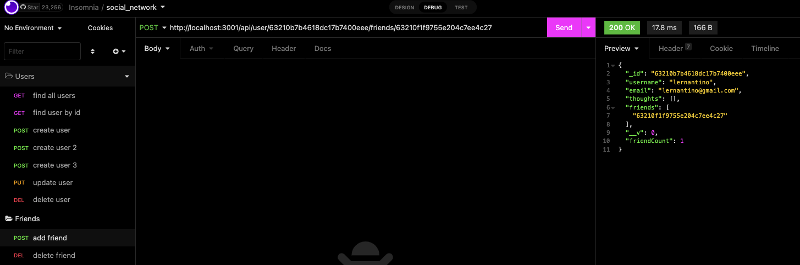
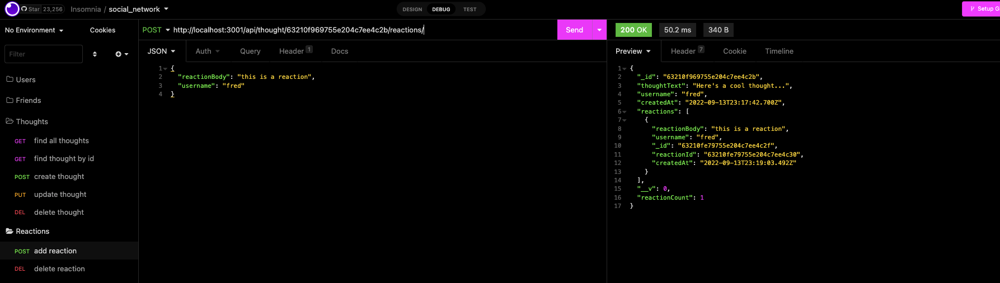
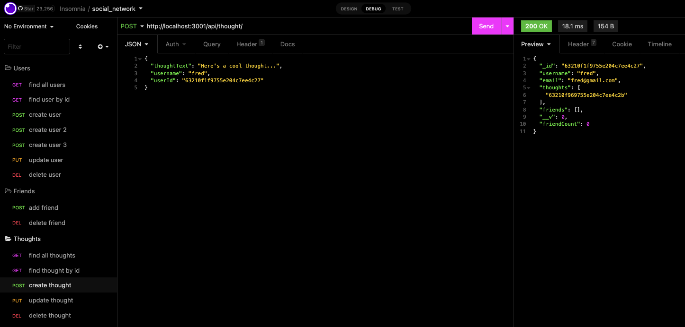
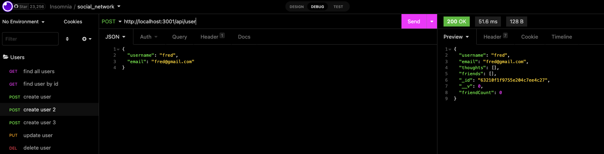
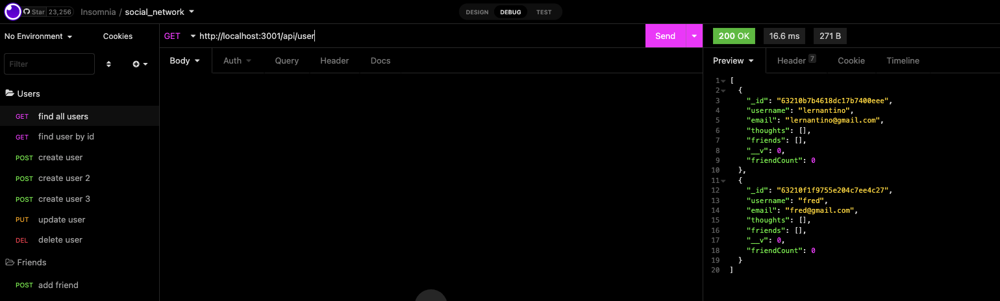
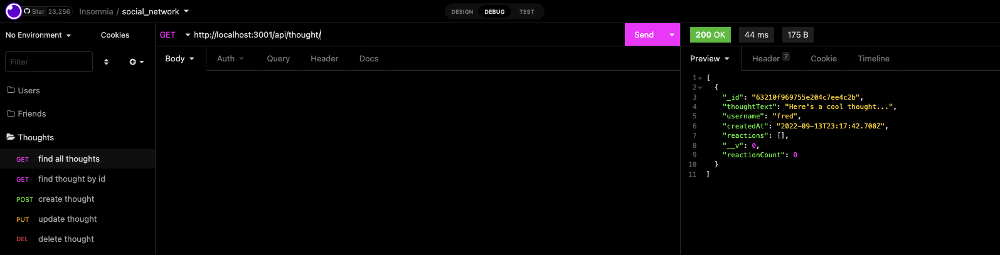

# social_network_api

## Description
This is an API for social media networks where uses can share thier thoughts, add friends and react to their friends thoughts. Using express.js for the routing and mongoDB for the database. All seed data is created through insomnia.

## Usage
Below are some screenshots from insomnia giving a sneak peak into sucessful working routes.

### Adding a friend
 
   ### Adding a reaction

   ### Creating a thought

   ### Create a User

   ### Find all Users

   ### Find all Thoughts

## Link
Youtube: https://youtu.be/HFeFk-ZQ_LI

## Contact
#### Any questions please contact me via:
#### Github: https://github.com/fredkamm
#### OR
#### Email: fred.kamm95@gmail.com